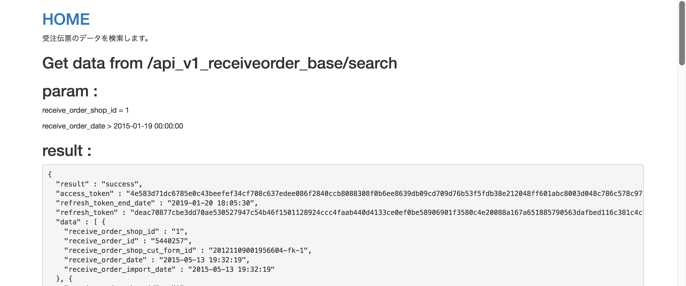
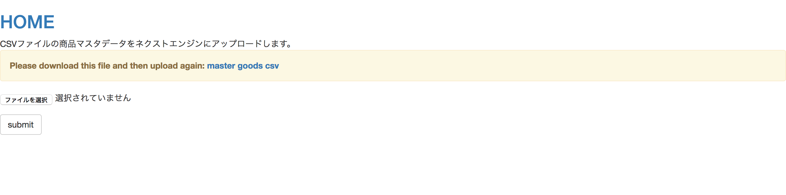
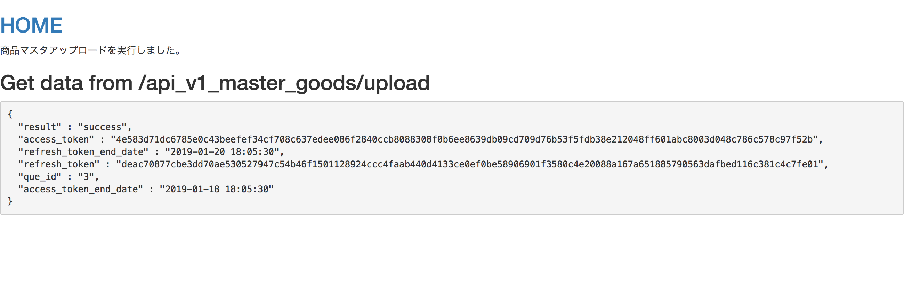

# Next Engine Java App Sample

This sample app is meant to provide a working example with Next Engine System.

This sample app is also the practical foundation of our used when creating Java applications using [Next Engine API](http://api.next-e.jp/). It will help you use Next Engine API easily and effectively.

For those who produce general apps, this foundation was released as "Next Engine Application Base".

Next Engine Java App Sample consists of the following:

- Search order slip - The search operation order slip in Next Engine with multiple search conditions
- Goods master upload - This operation is the same as goods master bulk registration, and it is registered when it becomes possible to register to the main function asynchronously.
- Update authentication token (access token and refresh token) - First, the app calls the "/users/sign_in/" API endpoint for users to input their NE account information. After successfully logging in, the app calls the "/api_neauth" API endpoint to retrieve the "access_token" and "refresh_token," which are subsequently saved to the database. By utilizing the "access_token" and "refresh_token," users will be able to call any NE API without having to login again.

This is not a seed project to be deployed to your production environment. In our sample apps, we strive to create an foundation that helps users easily build effective, clearly-defined and maintainable apps that use the Next Engine System. However, clarity is ultimately the most important quality in a sample app.


# Installation


### System Requirements :
- Vagrant

### Run :

#### 1. Create App on Next Engine.

- Please check below.

  http://manual.next-e.jp/screen/make/new/

#### 2. Create API of App on Next Engine.

- Please check below.

  http://manual.next-e.jp/screen/make/new/tabb5/

  - Set "https://localhost:8443" to redirect url
  - Create Clinet ID and Client Secret

#### 3. Setup the clientId and clientSecret

- Open the file src/main/resources/ne-api.properties and change the following values which is app setting 

```
clientId = XXXXX
clientSecret = XXXXX
```

#### 4. Run the app

- Step 1 : Run the app
```
vagrant up
```
- Step 2 : Open https://localhost:8443/ in a web browser

## Screenshots 


---



---



---



# Help and Docs

- [App Document (Japanese)](https://github.com/hamee-dev/java-sample-code/blob/master/docs_JP/index.md)
- [NE API Document](http://api.next-e.jp/)

# Contributing
1. Fork it ( https://github.com/[my-github-username]/java-sample-code)
2. Create your feature branch (git checkout -b my-new-feature)
3. Commit your changes (git commit -am 'Add some feature')
4. Push to the branch (git push origin my-new-feature)
5. Create a new Pull Request
