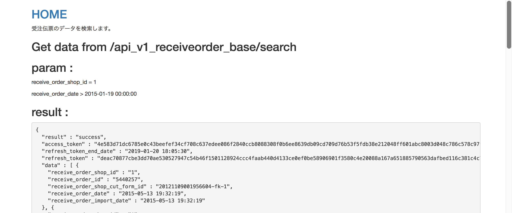
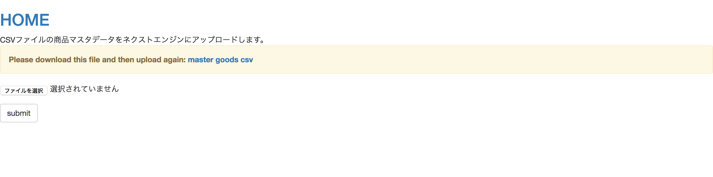

# 概要  

__`ne_java_sample`__プロジェクトは **Next-engine APIを使用するデモ** を提供するプロジェクトです。
また、Next-engine APIを使用すると共にnext-engineに登録する必要がある１つのアプリケーションをビルドするための  **簡単な参考テンプレート** も提供します。

プロジェクトのメイン機能は以下になります。

* 確認して、next-engine アカウントにログインするよう催促します。
* __`receiveorder_base`__   を検出します。 

* (.csv)    ファイルを一つアップロードします。

---

* ログイン認証の情報を自動的に確認・更新します。(バックグランンドで実行)

